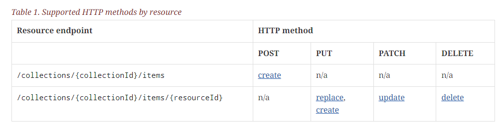

# WFS-T

## Points clés

- WFS-T est une extension de WFS permettant de modifier des données
- WFS-T permet d'opérer les trois opérations (INSERT, UPDATE et DELETE)

## Modèle de transaction

Il y a deux façons d'offrir une API pour réaliser des transactions :

- Envoyer la liste des objets créés, modifiés ou supprimés
- Encoder la requête SQL correspondante (INSERT, UPDATE ou DELETE) en XML avec un filtre (WHERE)

La première est celle qui est retenue par l'API OSM (changeset) et par l'IGN au niveau de l'[Espace Collaboratif](https://espacecollaboratif.ign.fr/) pour permettre :

- La détection de conflit d'édition (OSM et IGN)
- Le contrôle des droits d'édition des différents attributs (IGN)

Or, WFS-T est sur la deuxième approche comme illustré dans la requête de suppression ci-dessous :

```xml
<?xml version="1.0" ?>
<wfs:Transaction
   version="2.0.0"
   service="WFS"
   xmlns:fes="http://www.opengis.net/fes/2.0"
   xmlns:wfs="http://www.opengis.net/wfs/2.0"
   xmlns:xsi="http://www.w3.org/2001/XMLSchema-instance"
   xsi:schemaLocation="http://www.opengis.net/wfs/2.0
                       http://schemas.opengis.net/wfs/2.0/wfs.xsd">

   <!-- DELETE FROM tasmania_roads -->
   <wfs:Delete typeName="topp:tasmania_roads">
      <!-- WHERE {Filter} -->
      <fes:Filter>
         <fes:ResourceId rid="tasmania_roads.14"/>
      </fes:Filter>
   </wfs:Delete>
</wfs:Transaction>
```

## Impact

Avec WFS-T :

- Pour bloquer certaines requêtes ( ex : `DELETE FROM tasmania_roads;` ), il faudrait parser les filtres.
- Même chose pour contrôler qu'un utilisateur a bien les droits pour modifier tel ou tel objet, voire tel ou tel attribut,...

En conséquence :

- WFS-T est adapté uniquement en cas de modèle de droit simple (utilisateur ayant des droits de contrôle total sur une table)
- Il est raisonnable de définir des API REST plus simple basée sur l'envoi des objets modifiés pour permettre un meilleur contrôle.

## Espoir à l'horizon!

Un draft dans OGC API Feature laisse entrevoir une approche REST pour la gestion des modifications :



> Source : [https://docs.ogc.org/DRAFTS/20-002r1.html#_scope - OGC API - Features - Part 4: Create, Replace, Update and Delete](https://docs.ogc.org/DRAFTS/20-002r1.html#_scope)


## Ressources

* [gist.github.com - SKalt - WFS-T 2.0.0 examples](https://gist.github.com/SKalt/0f4b757209687331c8a1d40aecbf69f9#wfs-t-200-examples)
* [ogcapi.ogc.org - OGC API - Features](https://ogcapi.ogc.org/features/)