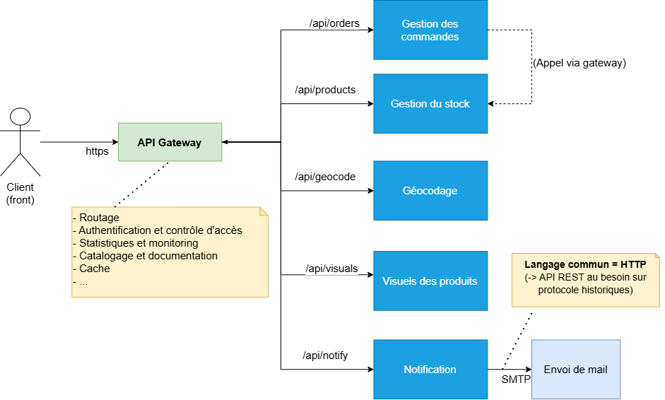

# Introduction à l'architecture des SI

---

## Plan

- [Introduction](#introduction)
- [Les principaux défis](#les-principaux-défis)
- [Les principes d'architecture](#les-principes-darchitecture)
- [Les critères qualités](#les-critères-qualités)
- [Les styles d'architecture](#les-styles-darchitecture)
- [Les spécificités liées aux données géographiques](#les-spécificités-liées-aux-données-géographiques)
- [Les infrastructures de données géographiques](#les-infrastructures-de-données-géographiques)

---

## Introduction

- [Définition d'un SI](#définition-dun-si)
- [Les différents types de SI](#les-différents-types-de-si)
- [Le système d'information géographique (SIG)](#le-système-dinformation-géographique-sig)
- [Par où commencer?](#par-où-commencer-12)
- [Comment allons nous procéder?](#comment-allons-nous-procéder-12)

---

### Définition d'un SI

> « Le **système d'information (SI)** est un ensemble organisé de ressources qui permet de collecter, stocker, traiter et distribuer de l'information, en général grâce à un réseau d'ordinateurs. »
> 
> Source [fr.wikipedia.org](https://fr.wikipedia.org/wiki/Syst%C3%A8me_d%27information)

Le SI se décompose en un **système organisationnel** et un **système technique** : Le **système informatique** (le matériel informatique, les logiciels, les données, les services, les réseaux,...)

---

## Introduction

### Les différents types de SI

Nous trouverons plusieurs types de systèmes d'information :

- Des **Systèmes d'Information des Ressources Humaines (SIRH)** pour gérer les absences, les paies, les recrutements... 
- Des **systèmes d'entreprise ou ERP (Enterprise Resource Planning)** pour gérer les processus et les ressources.
- Des **systèmes d'aide à la décision** s'appuyant sur des analyses de données internes ou externes
- ...

---

## Introduction

### Le système d'information géographique (SIG)

Le **SIG** sera un type de SI se focalisant sur la **gestion des données spatiales** :

> « Un **système d'information géographique ou SIG** est un système d'information conçu pour **recueillir**, **stocker**, **traiter**, **analyser**, **gérer** et **présenter** tous les types de **données spatiales et géographiques** »
> 
> (Source : [fr.wikipedia.org - Système d'information géographique](https://fr.wikipedia.org/wiki/Syst%C3%A8me_d%27information_g%C3%A9ographique))

---

## Introduction

### Par où commencer? (1/2)

En pratique, nous traiterons des sujets d'architecture à plusieurs échelles :

- Une **application**
- Une **solution**
- Une **entreprise**

---

## Introduction

### Par où commencer? (2/2)

Or :

- L'architecture des SI est une discipline qu'il est difficile d'aborder sans une expérience à l'échelle des applications et des solutions.
- Il y a de nombreux de points intéressants à traiter (c.f. [roadmap.sh - Software Architect](https://roadmap.sh/software-architect))...

---

## Introduction

### Comment allons nous procéder? (1/2)

Dans cette introduction, nous chercherons **à poser une vision claire de l'architecture des SI** en abordant :

- Les **principaux défis** à relever.
- Les **objectifs visés**, définis à travers différents **critères qualités**.
- Les **principes d'architecture** qui guideront dans la conception des solutions.
- Les **styles d'architecture** classiques et leurs usages.

---

## Introduction

### Comment allons nous procéder (2/2)

Nous ferons ensuite un focus sur l'**architecture <u>logique</u> des systèmes d'information géographique (SIG)** en abordant :

- Les **spécificités des données géographiques**.
- L'**architecture d'une infrastructure de données géographique (IDG)**

Les éléments relatifs à l'**architecture <u>technique</u>** et à la **gestion du cycle de vie des applications** seront traités dans le **cours DevOps**.

---

## Les principaux défis

- [Hétérogénéité des acteurs](#hétérogénéité-des-acteurs-12)
- [Documentation de l'architecture](#documentation-de-larchitecture-14)
- [Documentation des interfaces](#documentation-des-interfaces)
- [Gouvernance et agilité](#gouvernance-et-agilité-13)
- [Sécurité et conformité](#sécurité-et-conformité)
- [Gestion des systèmes hérités (legacy)](#gestion-des-systèmes-hérités-legacy)
- [Prioriser les critères qualités](#prioriser-les-critères-qualités)

---

### Hétérogénéité des acteurs (1/3)

La conception d'une architecture devra **prendre en compte de nombreux acteurs** :

- Les **utilisateurs** (internes ou externes)
- Les **métiers** ("MOA")
- Les **développeurs** ("MOE")
- La **sécurité** (RSSI, DPO,...)
- Les **décideurs**
- Les **partenaires**
- Les **prestataires**
- ...

---

### Hétérogénéité des acteurs (2/3)

En particulier, il conviendra de :

- Répondre aux **objectifs et intérêts souvent divergents** de ces différents acteurs.
- Préciser les **rôles et responsabilités des différents acteurs** (ex : [rédiger un RACI](https://fr.wikipedia.org/wiki/RACI))

---

### Hétérogénéité des acteurs (3/3)

Aussi, il conviendra de traiter des **injonctions techniques** qui ne seront **pas toujours optimales** :

- Confusion fréquente entre l'**expression d'un besoin fonctionnel** (ex : je veux partager des fichiers) et la **proposition d'une solution technique** (ex : je veux utiliser dropbox, google drive ou équivalent)
- **Lien étroit entre la politique et des décisions techniques structurantes** (1).

> (1) Nous verrons quelques exemples (à l'oral).

---

## Les principaux défis

### Documentation de l'architecture (1/3)

Pour **avoir vision complète et partagée du système** et **pouvoir discuter les évolutions**, il sera important de **documenter l'architecture** tant sur :

- Le plan **métier** (les produits et leurs fonctionnalités)
- Le plan **organisationnel** (les équipes, les processus, les procédures,...)
- Le plan **logique** (les outils, les services, les traitements,...)
- Le plan **technique** (les centres de données, les zones, les réseaux, les machines...)

---

## Les principaux défis

### Documentation de l'architecture (2/3)

Nous noterons qu'il est **théoriquement possible de documenter l'intégralité d'un SI avec des schéma UML**. C'est l'objet du modèle 4 + 1 vues proposé par Philippe Kruchten en 1995 :

Source : [www.irisa.fr - Représentation des vues d’architecture avec UML - Pierre-Alain Muller](https://www.irisa.fr/triskell/members/pierre-alain.muller/teaching/architecture) 

---

## Les principaux défis

### Documentation de l'architecture (3/3)

Toutefois :

- La maintenance d'une **documentation UML complète et rigoureuse à l'échelle d'un SI est utopique** au regard de la **fréquence des évolutions**
- **Présenter le bon niveau de détail aux différents acteurs ne sera pas évident** d'où :
  - Des approches hiérarchiques telles [C4 model](https://c4model.com)
  - L'intérêt d'**utiliser des approches modernes en matière de documentation** (1)

> (1) A ce stade, bien comprendre la **puissance des pages HTML par rapport aux documents classiques (.docx, .pdf, .odt) pour offrir plusieurs niveaux de lecture!**

---

## Les principaux défis

### Documentation des services

Il conviendra de **documenter précisément les interfaces** des différents services du SI.

Pour les API REST/JSON, nous systématiserons par exemple la rédaction de spécifications au format [OpenAPI](https://swagger.io/specification/).

> Nous utiliserons l'éditeur en ligne [editor.swagger.io](https://editor.swagger.io/) pour voir concrètement de quoi il est question. Nous verrons un cas concret avec le [service d'autocomplétion de la Géoplateforme](https://geoservices.ign.fr/documentation/services/services-geoplateforme/autocompletion).

---

## Les principaux défis

### Gouvernance et agilité (1/4)

La nécessité d'**assurer la cohérence** et de **rationnaliser** (i.e. éviter les silos technologiques) à l'échelle du SI induira un besoin de **standardisation**.

---

## Les principaux défis

### Gouvernance et agilité (2/4)

Nous noterons l'existence de cadres rigoureux tels [TOGAF (The Open Group Architecture Framework)](https://fr.wikipedia.org/wiki/The_Open_Group_Architecture_Framework) pour maîtriser l'architecture des SI d'entreprise et piloter les évolutions.

---

## Les principaux défis

### Gouvernance et agilité (3/4)

Toutefois :

- **TOGAF sera difficilement applicable à toutes les échelles d'un SI**.
- **Imposer un cadre technique trop strict et trop figé** induira deux risques :
  - Le **blocage de l'innovation**
  - Le [Shadow IT](https://fr.wikipedia.org/wiki/Shadow_IT).

---

## Les principaux défis

### Gouvernance et agilité (4/4)

A ce titre, il sera plus intéressant de :

- Mettre en place des **standards flexibles**.
- **Décrire le cadre technique** (sans le figer)
- Poser un **cadre pour gérer les évolutions** (ex : [Architecture Decision Record (ADR)](https://blog.octo.com/architecture-decision-record))

---

## Les principaux défis

### Sécurité et conformité

La conception d'une architecture devra prendre en compte le besoin de :

- Garantir la **confidentialité**, l'**intégrité** et la **disponibilité** des données.
- Respecter la **réglementation** (RGPD, [sécurité des systèmes d'information](https://cyber.gouv.fr/sinformer-sur-la-reglementation), directive INSPIRE,...)

Il conviendra de **prendre en compte ces besoins** :

- **Dès la conception** et **dans le cycle de vie des projets** (1).
- **Prioriser et arbitrer** par rapport à la réponse aux besoins métiers.

> (1) Nous aborderons par la suite ***security by design*** et dans le cours suivant l'approche **DevSecOps**.

---

## Les principaux défis

### Gestion des systèmes hérités (legacy)

Les organisations posséderont souvent des **systèmes avec une conception obsolète** pouvant jouer un rôle central dans le SI.

Il conviendra de **"refactorer" propressivement le SI** pour **traiter cette dette technique au cas par cas** :

- Modernisation de la méthode d'authentification (ex : login/password -> OIDC)
- Remplacement d'un service obsolète par un nouveau (1)
- ...

> (1) Voir [patron figuier étrangleur](https://docs.aws.amazon.com/en_en/prescriptive-guidance/latest/modernization-decomposing-monoliths/strangler-fig.html) qui illustre ce point.

---

## Les principaux défis

### Prioriser les critères qualités

Concevoir un système parfait est une utopie. **Sans objectifs clairs**, nous risquons de concevoir des systèmes **trop complexes ou trop coûteux** par rapport au contexte (ex : 10 utilisateurs maximum, indisponibilités acceptables, perte totale des données acceptée...).

Il est donc crucial de **définir et prioriser ces objectifs dès le départ** afin que les choix architecturaux soient guidés par des critères mesurables et pertinents.

Toutefois, cet exercice sera loin d'être évident...

> Par exemple, il faudra expliquer qu'un **système résistant indéfiniment à la charge** peut rapidement se traduire par une **facture cloud exorbitante**.

---

## Les critères qualités

Conception et intégration :

- [Évolutivité](#évolutivité)
- [Réutilisabilité](#réutilisabilité)
- [Interopérabilité](#interopérabilité)
- [Conformité aux normes](#conformité-aux-normes)

Robustesse et exploitation :

- [Performance](#performance)
- [Résilience](#résilience)
- [Scalabilité](#scalabilité)
- [Observabilité](#observabilité)
- [Portabilité](#portabilité)

---

## Les critères qualités

### Évolutivité

L'architecture doit **permettre des évolutions futures** sans remettre en cause l'ensemble du système.

---

## Les critères qualités

### Réutilisabilité

Produire des **composants réutilisables** permet d'optimiser le développement et d'améliorer la qualité du SI en réduisant les redondances de code.

---

## Les critères qualités

### Interopérabilité

Les composants doivent être **capables de communiquer entre eux** même s'ils proviennent de **systèmes différents**.

---

## Les critères qualités

### Conformité aux normes

Le respect des standards (ex : [standards OGC](https://www.ogc.org/standards/)) et bonnes pratiques de l’industrie (ex : REST/JSON + OpenAPI) facilite l'**interopérabilité**, la **réutilisation**, et la **maintenabilité**.

---

## Les critères qualités

### Performance

Le système doit être conçu pour répondre à **plusieurs objectifs de performance** :

- Minimiser la durée d'exécution des traitements.
- Minimiser la consommation en ressources systèmes (CPU, RAM, stockage et réseau).
- Minimiser le coût (1).

> (1) Vu la complexité des modèles de facturation dans les environnements infonuagiques, ce dernier point sera l'objet d'une discipline à part entière connue sous le nom [FinOps](https://learn.microsoft.com/fr-fr/cloud-computing/finops/overview).

---

## Les critères qualités

### Résilience

Le système doit être conçu pour **continuer à fonctionner (ou se dégrader de façon contrôlée) en cas de défaillance** d’un ou plusieurs composants.

Par exemple, pour traiter le cas d'une **indisponibilité temporaire d'un service tiers**, nous trouvons le [patron "**nouvelle tentative**" (retry)](https://learn.microsoft.com/fr-fr/azure/architecture/patterns/retry).

Sinon, pour assurer la **disponibilité en cas de problème**, nous trouvons principalement deux stratégies qui seront détaillées dans le cours DevOps :

- **Réplication** des services.
- **Redémarrage automatique** en cas de problème.

---

## Les critères qualités

### Scalabilité

L'architecture doit être conçue pour **supporter la montée en charge** (évolution du nombre de clients, du volume des données,...) sans perte de performance.

Nous trouverons deux stratégies :

- La **scalabilité verticale** (modification du dimensionnement des machines).
- La **scalabilité horizontale** (multiplication du nombre de machines), plus intéressante mais plus complexe à mettre en oeuvre (1).

> (1) Nous détaillerons le cas des **services sans état** dans le cadre du cours DevOps. Le cas des **services de stockage** sera laissé au cours sur le stockage NoSQL qui abordera à priori la **réplication et la distribution du stockage** et le [théorème CAP](https://fr.wikipedia.org/wiki/Th%C3%A9or%C3%A8me_CAP)

---

## Les critères qualités

### Observabilité

Le système doit être instrumenté pour **permettre l'identification et résolution** rapide des problèmes.

> Nous détaillerons ce point dans le cadre du cours DevOps.

---

## Les critères qualités

### Portabilité

Les composants doivent être **capables de fonctionner dans différents environnements** (ex. cloud, on-premise) sans nécessiter de modifications majeures.

> Nous verrons dans le cadre du cours DevOps que le respect des [12 facteurs](https://12factor.net/fr/) y contribue grandement.

---

## Les principes d'architecture

- [**Séparation des préoccupations**](#séparation-des-préoccupations-separation-of-concerns)
- [**Modularité**](#modularité)
- [**Abstraction**](#abstraction)
- [**Encapsulation**](#encapsulation-12)
- [**Couplage faible**](#couplage-faible-12)
- [Sécurité intégrée dans la conception](#sécurité-intégrée-dans-la-conception)
- [Utilisation de protocoles efficaces](#utilisation-de-protocoles-efficaces-12)

---

## Les principes d'architecture

### Séparation des préoccupations (*Separation of Concerns*)

A l'échelle du système, **chaque composant doit avoir une responsabilité claire et unique**.

> Nous retrouvons ce principe en P.O.O. dans le S de SOLID avec le **principe de responsabilité unique (*Single responsibility principle*)**.

<!--
Par exemple :
- Nous utiliserons un service dédié pour gérer les authentifications (ex : AD LDAP, Keycloak, DEX,...)
- Un service renvoyant l'altitude d'un point ne prendra pas paramètre une adresse mais une position.
-->

---

## Les principes d'architecture

### Modularité

Le **système est décomposé en plusieurs modules** qui peuvent être **développés, testés et maintenus séparément**.

---

## Les principes d'architecture

### Abstraction (1/2)

L'**abstraction** est un processus consistant à **se concentrer sur les caractéristisques essentielles** d'un composant ou d'un système **tout en ignorant les détails**.

---

## Les principes d'architecture

### Abstraction (2/2)

L'abstraction intervient à toutes les échelles d'un système :

- Les **classes et interfaces** d'un **composant**.
- Les **services** d'un **système**.
- Les différentes **couches du système** (interface graphique, logique métier, persistance des données)

La principale difficulté consistera à **nommer et modéliser des concepts**.

---

## Les principes d'architecture

### Encapsulation (1/2)

Les **interactions entre modules** se font uniquement **via des interfaces bien définies**. Les détails internes sont cachés aux autres modules.

---

## Les principes d'architecture

### Encapsulation (2/2)

En pratique, nous pourrons **encapsuler une fonctionnalité** en mettant à disposition une **API** qui pourra prendre plusieurs formes :

- Une **API WEB**.
- Une **application en ligne de commande (CLI)**.
- Une **interface dans une bibliothèque de programmation**.

> Nous aborderons en séance les points forts et points faibles de ces différentes approches en analysant quelques cas pratiques (recherche des communes par nom et code postal, simplification des géométries,...). Vous trouverez plus de détail dans la fiche [les API WEB et les autres](https://mborne.github.io/fiches/api/).

---

## Les principes d'architecture

### Couplage faible (1/2)

Les modules doivent être aussi indépendants que possible les uns des autres. Un **couplage faible** facilite la **modification ou le remplacement de modules** sans affecter les autres parties du système.

---

## Les principes d'architecture

### Couplage faible (2/2)

Nous noterons que le couplage pourra prendre plusieurs formes :

- **Message ou événement** : producteurs et consommateurs partagant un canal et un format de message (ex : "location_change" pour une flotte de véhicules).
- **Interface** : dépendance au contrat d'échange (ex : paramètres d'une API)
- **Données** : dépendance au schéma ou au format partagé (ex : schéma BDTOPO).
- **Temporel** : dépendance à un ordre ou un moment précis d’exécution (ex : intégration de données après génération d'un export).

---

## Les principes d'architecture

### Sécurité intégrée dans la conception

Par exemple, l'approche [*secure by design*](https://www.oracle.com/fr/security/secure-by-design/) invite entre autre à :

- **Minimiser la surface d'attaque** (minimiser l'exposition de service, utiliser des frameworks évitant les failles courantes,...)
- Appliquer le **principe de moindre privilège**.
- Adopter une **stratégie de défense en profondeur** (ne pas se contenter de la sécurité périmétrique!).
- Prendre des précautions vis-à-vis des services tiers.

---

## Les principes d'architecture

### Utilisation de protocoles efficaces (1/2)

Pour les **performance**, il conviendra d'**utiliser des protocoles efficaces et adaptés au contexte**.

---

## Les principes d'architecture

### Utilisation de protocoles efficaces (2/2)

Dans le cas **des services web**, la recherche de l'efficacité se retrouve dans l'**évolution des formats et protocoles** :

* Fin des années 90, le **format [XML](https://fr.wikipedia.org/wiki/Extensible_Markup_Language)** domine avec **[WSDL](https://fr.wikipedia.org/wiki/Web_Services_Description_Language)** (Web Services Description Language) et **[SOAP](https://fr.wikipedia.org/wiki/SOAP)** (Simple Object Access Protocol).
* Depuis ~2005, les API [REST](https://fr.wikipedia.org/wiki/Representational_state_transfer) et le **format [JSON](https://fr.wikipedia.org/wiki/JavaScript_Object_Notation)** gagnent du terrain.
* 2011, [WebSocket](https://fr.wikipedia.org/wiki/WebSocket) permet une communication bidirectionnelle.
* 2012, [GraphQL](https://graphql.org/) vise à limiter le nombre de requêtes et le volume de données transférées.
* 2015, gRPC s'appuie sur le **format [Protocol Buffers](https://protobuf.dev/)** et HTTP/2.

---

## Les styles d'architecture

- [Architecture monolithique](#architecture-monolithique-12)
- [Architecture client/serveur](#architecture-clientserveur)
- [Architecture 3-tiers](#architecture-3-tiers)
- [Architecture n-tiers](#architecture-n-tiers)
- [Architecture pilotée par les événements (EDA)](#architecture-pilotée-par-les-événements-eda-12)
- [Architecture orientée services (SOA)](#architecture-orientée-services-soa)
- [Architecture microservices](#architecture-microservices)
- [Architecture serverless](#architecture-serverless)

---

### Architecture monolithique (1/2)

> "Une **architecture monolithique** est un modèle de développement logiciel traditionnel qui utilise une **base de code unique** pour exécuter **plusieurs fonctions métier**. Tous les **composants** logiciels d'un système monolithique sont **interdépendants en raison des mécanismes d'échange de données au sein du système**."
> 
> Source : [aws.amazon.com - Quelle est la différence entre une architecture monolithique et une architecture de microservices ?](https://aws.amazon.com/fr/compare/the-difference-between-monolithic-and-microservices-architecture/) :

---

### Architecture monolithique (2/2)

Pour illustrer le concept, nous analyserons les avantages et inconvénients avec :

- Une application web classique.
- L'[API Overpass](https://overpass-turbo.eu/), ["*a database engine to query the OpenStreetMap data.*"](https://github.com/drolbr/Overpass-API)
- [GeoServer](https://geoserver.org/) et ses nombreux services (administration, WFS, WMS, WMTS, stockage,...)

Pour mettre en pratique, nous débuterons l'étude d'un cas concret : [IRL - un jeu qui varie les défis dans le monde réel!](https://github.com/mborne/cours-archi-si-geo/blob/master/exercices/irl.md#irl).

---

## Les styles d'architecture

### Architecture client/serveur

L'architecture client / serveur est la plus simple **architecture en couche**.

Illustration d'une architecture Client / Server avec [QGIS](https://qgis.org/) branché directement sur une base de données.

---

## Les styles d'architecture

### Architecture 3-tiers

L'architecture 3-tiers se matérialisera souvent par la présence d'un intermédiaire entre le client et le stockage :

Illustration d'une architecture 3 tiers avec l'[API OSM](https://wiki.openstreetmap.org/wiki/API_v0.6).

---

## Les styles d'architecture

### Architecture n-tiers

En pratique, nous aurons plus souvent des **architecture n-tiers** avec par exemple une couche pour **répartir la charge sur plusieurs instances d'un service** :

Illustration du principe des architectures n-tiers avec la répartition de charge.

...ainsi que des couches **mettre en cache les réponses**, pour **filtrer les attaques** ([WAF](https://fr.wikipedia.org/wiki/Web_application_firewall)),...

---

## Les styles d'architecture

### Architecture pilotée par les événements (EDA) (1/2)

Dans une architecture pilotée par les événements (ou ***Event-driven Architecture (EDA)***), les composants communiquent entre eux à l'aide de message :

Illustration du principe d'une architecture pilotée par les événements.

---

## Les styles d'architecture

### Architecture pilotée par les événements (EDA) (2/2)

Nous distinguerons deux approches :

- **Publication/abonnement (*Pub/sub*)** où les consommateurs s'abonnent à un canal pour recevoir les messages.
- **flux d'événement (*Event streaming*)** où les événements sont journalisées et où les consommateurs peuvent lire les anciens messages.

Nous inspecterons les possibilités offertes par [RabbitMQ](https://www.rabbitmq.com/tutorials) pour nous faire une idée précise.

> Nous discuterons l'intérêt et les défis de ce type d'architecture à travers des cas d'utilisations en séance (partage de position, traitement asynchrone, orchestrateur de traitements,...).

---

## Les styles d'architecture

### Architecture orientée services (SOA)

Dans une architecture orientée services (SOA), les applications communiquent entre elles à travers un [Enterprise Service Bus](https://fr.wikipedia.org/wiki/Enterprise_service_bus) qui offre un **cadre pour l'interfaçage de services hétérogènes** :

Illustration du principe de l'ESB dans les architectures SOA.

> Nous en discuterons l'intérêt et les limites en séance en faisant le lien avec EDA et pour introduire la partie suivante.

---

## Les styles d'architecture

### Architecture microservices 

L'application est décomposée en **services légers se concentrant sur une tâche spécifique**. Ils sont **développés et déployés indépendamment** et **peuvent communiquer entre eux**.

Illustration du principe d'une architecture microservice.

> Nous analyserons en séance le cas de [GeoServer cloud](https://github.com/geoserver/geoserver-cloud?tab=readme-ov-file#geoserver-cloud) correspondant au découpage du monolithe en microservices. Nous discuterons aussi les avantages et inconvénients.

---

## Les styles d'architecture

### Architecture serverless

Dans une architecture **serverless**, les applications dépendent de services cloud pour exécuter des fonctions, stocker des données et gérer des événements **sans que les développeurs aient besoin de gérer directement les serveurs**.

En pratique, le cadre correspondant amènera souvent à coupler une approche par **microservices** (1) avec une approche basée sur des **événements** (EDA) pour les traitements longs ou asynchrones.

> (1) Hébergement de fonctions simples (AWS Lambda, Azure Functions, ou Google Cloud Functions) voire de conteneurs (ex : Google Cloud Run)

---

## Les spécificités liées aux données géographiques

- [La diversité des données](#la-diversité-des-données)
- [La diversité des acteurs](#la-diversité-des-acteurs)
- [La diversité des modes de production](#la-diversité-des-modes-de-production)
- [La directive INSPIRE](#la-directive-inspire)
- [Les standards CNIG](#les-standards-cnig)
- [Des formats dédiés](#des-formats-dédiés)
- [Des services dédiés](#des-services-dédiés)
- [Des services gourmands en ressources](#des-services-gourmands-en-ressources-12)

---

## Les spécificités liées aux données géographiques

### La diversité des données

Les données géographiques prennent **différentes formes** avec des **volumes et des modèles de complexité variables** :

- Des **images**
- Des **nuages de points**
- Des **données vectorielles**
- Des **fiches de métadonnées**
- ...

---

## Les spécificités liées aux données géographiques

### La diversité des acteurs

De nombreux acteurs produisent des données géographiques :

- Les **acteurs collaboratifs** (OSM)
- Les **acteurs publics nationaux** (INSEE, IGN, BRGM...)
- Les **collectivités territoriales** (régions, départements, regroupement de communes, communes,...)
- Les **entreprises privées** (Google Maps, Waze, LaPoste,...)

---

## Les spécificités liées aux données géographiques

### La diversité des modes de production

Cette diversité induit une **diversité des modes de production des données** avec en particulier :

- Une **production centralisée** (dans une base nationale ou mondiale)
- Une **production décentralisée** (à l'échelle infra-nationale) nécessitant une **agrégation** à l'échelle nationale pour être pleinement exploitable.

---

## Les spécificités liées aux données géographiques

### La directive INSPIRE

Dans ce contexte, nous soulignerons l'importance de la [directive européenne INSPIRE du 14 mars 2007](https://www.ecologie.gouv.fr/politiques-publiques/directive-europeenne-inspire) (1) qui impose [pour certains thèmes](http://formations-geomatiques.developpement-durable.gouv.fr/NAT009/Inspire/directive_inspire_neophytes/co/directive_inspire_neophytes_7.html) :

- Le **catalogage des données** via les métadonnées pour **permettre la connaissance de l'ensemble des données déjà produites** (2).
- L'utilisation de **standards pour diffusion des données** (ex : [les standards OGC](https://www.ogc.org/standards/)) pour permettre l'**intéropérabilité**.

> (1) Voir [formations-geomatiques.developpement-durable.gouv.fr - La directive Inspire pour les néophytes](http://formations-geomatiques.developpement-durable.gouv.fr/NAT009/Inspire/directive_inspire_neophytes/co/directive_inspire_neophytes_1.html)

---

## Les spécificités liées aux données géographiques

### Les standards CNIG

Pouvoir **rechercher des jeux de données** et **permettre l'agrégation des jeux de données** sont **deux choses différentes**.

Le [Conseil national de l'information géolocalisée (CNIG)](https://cnig.gouv.fr/) se charge à ce titre de la production de standards complémentaires à ceux d'INSPIRE.

Par exemple, la possibilité d'agréger des documents d'urbanisme (PLU, PLUi, CC,...) dans une base nationale au niveau du [GéoPortail de l'Urbanisme](https://www.geoportail-urbanisme.gouv.fr/) dépend de l'existence et du respect de ces standards CNIG.

---

## Les spécificités liées aux données géographiques

### Des formats dédiés

Les données géographiques s'appuient sur des **formats dédiés** pour :

- Les **données vectorielles** (GML basé sur XML, GeoJSON basé sur JSON,...) avec une fâcheuse tendance à réinventer les formats pour mettre en avant la composante spatiale (1).
- Les **fiches de métadonnées** (XML / ISO 19115)
- Les **images** (ex : GeoTIFF)

> (1) [GeoJSON](https://geojson.org/) ne se contente pas de définir un format pour sérialiser des géométries, GeoJSON introduit le concept de `FeatureCollection` et de `Feature` relégant au second plan les `properties` autres que la `geometry`.

---

## Les spécificités liées aux données géographiques

### Des services dédiés

De même, nous avons des **services standardisés** pour :

- L'accès aux **données images (WMS/WMTS/WCS)**
- L'accès aux **données vectorielles (WFS)** et aux **traitements (WPS)**
- L'accès aux **métadonnées (CSW)**...

Nous noterons que :

- Les **standards en vigueur** ont une **forte dépendance aux technologies XML (XSD, WSDL,...)** qui étaient à la pointe en 2007.
- Des travaux de modernisation de ces standards sont en cours avec [OGC API](https://ogcapi.ogc.org/)

---

## Les spécificités liées aux données géographiques

### Des services gourmands en ressources (1/2)

Les services **manipulant des données géographiques** sont souvent **gourmands en ressources systèmes** :

- Calcul géométrique
- Rendu cartographique
- Calcul d'itinéraire
- Calcul d'isochrone
- ...

---

## Les spécificités liées aux données géographiques

### Des services gourmands en ressources (2/2)

Au niveau de l'architecture, il sera donc important de :

- **Porter une attention particulière à la scalabilité.**
- **Mettre en oeuvre des mécanismes de cache.**
- **Profiter de l'asymétrie entre la production et la consommation des données** en s'appuyant sur des patrons tels [CQRS](https://learn.microsoft.com/fr-fr/azure/architecture/patterns/cqrs).
- **Distinguer** le **respect des obligations INSPIRE** et la **réponse au besoin des utilisateurs** (1).

> (1) NB : INSPIRE n'impose pas de concevoir ses applications métiers en surcouche de WFS (où il faut télécharger "BDTOPO_V3:batiment" pour compter le nombre de bâtiments pour chaque "nature").

---

## Les infrastructures de données géographiques

- [Définition](#définition)
- [Objectifs](#objectifs)
- [Stockage des données](#stockage-des-données-12)
- [Alimentation en données](#alimentation-en-données-13)
- [Modélisation des données](#modélisation-des-données-12)
- [Catalogage](#catalogage-12)
- [Diffusion vecteur](#diffusion-vecteur-14)
- [Diffusion cartographique](#diffusion-cartographique-15)
- [Services de calcul](#services-de-calcul)
- [Exemple d'architecture](#exemple-darchitecture)

---

## Les infrastructures de données géographiques

### Définition

> « Une infrastructure de données géographiques est une structure de mutualisation, d’échange et de diffusion de données géographiques à l’échelle d’un territoire et au bénéfice d’acteurs publics, et indirectement des citoyens. »
> 
> Source : Afigeo

---

## Les infrastructures de données géographiques

### Objectifs

La mise en oeuvre d'une IDG répondra à plusieurs objectifs :

- **Centraliser et standardiser la gestion des données géographiques**, y compris le catalogage
- Offrir des **services facilitant l'accès, la transformation et l'exploitation des données**.
- Promouvoir le **partage et la réutilisation des données géographiques**.
- Se mettre en **conformité avec la directive INSPIRE**.
- **Mutualiser les coûts** liés à l’acquisition et à la gestion des données.
- Encourager la collaboration autour des données.

---

## Les infrastructures de données géographiques

### Comment ça marche?

Dans ce cours sur l'architecture des SI, nous allons tâcher d'avoir une vision précise de la conception d'une infrastructure d'une IDG.

Nous allons traiter thèmes par thèmes, du stockage à la diffusion des données.

---

## Les infrastructures de données géographiques

### Stockage des données (1/2)

Une IDG est amenée à stocker des données sous plusieurs formes :

- Des **fichiers (PDF, ZIP, Excels, CSV,...)** avec plusieurs options de stockage :
  - Le **stockage classique** sur disque.
  - Le **stockage en réseau** (partage, NFS, FTP,...).
  - Le **stockage objet** (S3, Google Cloud Storage,...)
- Des **bases de données** :
  - **SQL** (PostgreSQL, Oracle,...) offrant des garanties [ACID](https://fr.wikipedia.org/wiki/Propri%C3%A9t%C3%A9s_ACID)
  - **NoSQL** (base orientée document, clé/valeur, recherche plein texte, graphe,...)

---

## Les infrastructures de données géographiques

### Stockage des données (2/2)

Nous noterons qu'il peut être intéressant de :

- **Partitionner les données** en cas de production décentralisée

> Nous décrirons en séance le partionnement des données au sein du [Géoportail de l'Urbanisme](https://www.geoportail-urbanisme.gouv.fr/)

- **Versionner les données** (i.e. conserver l'historique des modifications) pour améliorer la **traçabilité des changements**, **pouvoir les annuler** et permettre une **réplication incrémentale**.

> Nous verrons aussi le principe exploité par l'IGN dans le cadre de la production de la BDTOPO. Vous pourrez aussi inspecter le [schéma de la base OSM](https://wiki.openstreetmap.org/wiki/Openstreetmap-website/Database_schema) où nous retrouvons une gestion de l'historique ("changeset", "nodes", "current_nodes",...)

---

## Les infrastructures de données géographiques

### Alimentation en données (1/3)

Pour gérer les données, nous pourrons exploiter les approches suivantes en en cas d'accès direct aux bases de données (1) :

- Utiliser un **SIG**
- Utiliser un **ETL** (ex : FME, Pentaho,...)
- Utiliser un **programme** (ex : ogr2ogr) ou un **script** (ex : import.py)

> (1) Voire en présence d'un protocole donnant un contrôle total sur les données tel WFS-T.

---

## Les infrastructures de données géographiques

### Alimentation en données (2/3)

Plus souvent, une plateforme proposera de choisir entre deux stratégies :

- La **publication des données** (mode "push")
  - Par téléversement un fichier
  - Par appel d'une API telle l'[API entrepot de la GéoPlateforme](https://geoplateforme.github.io/entrepot/production/) (1)
- Le **moissonnage de services tiers** (mode "pull") (2)

> (1) Nous analyserons en séance le cas de la [publication de données vecteurs](https://geoplateforme.github.io/tutoriels/production/vecteur/base/).
>
> (2) Nous inspecterons le cas de [OpenDataSoft qui propose entre autre des moissonneurs](https://userguide.opendatasoft.com/l/fr/category/1x1sytwnvf-publier-de-la-donn-es)

---

## Les infrastructures de données géographiques

### Alimentation en données (3/3)

En offrant un contrôle limité, la plateforme pourra ainsi traiter un **besoin récurrent** : **Valider les données** avant leur intégration afin d'assurer l'intégrité de la base de données.

---

## Les infrastructures de données géographiques

### Modélisation des données (1/3)

Documenter le **modèle (conceptuel)** des données permet **l'exploitation des données** par les utilisateurs.

Mettre à dispositon le **schéma (implémentation)** des données dans un **format exploitable** permet d'automatiser :

- La **validation des données** dans le cadre des publications de données.
- La **génération des formulaires** pour **guider dans la saisie**.

---

## Les infrastructures de données géographiques

### Modélisation des données (2/3)

Nous discuterons en séance différentes appproches possibles :

- Les **diagrammes de classes UML** (ex : [INSPIRE UML models - AdministrativeUnit](https://inspire-mif.github.io/uml-models/approved/html/index.htm?guid=85BF8670-5D59-4f6c-A1B4-F95DC0AF6876))
- Les **documents incluants des diagrammes UML et descriptions de table** (ex : [CNIG - Standard CNIG PLU v2024](https://www.geoportail-urbanisme.gouv.fr/manuals/#manuals_ab514d4b987fb135fc3eb6a196aef902))
- Les **tables décrivant les valeurs codifiées** (ex : [www.insee.fr - COG](https://www.insee.fr/fr/information/6800685))
- Les **méta-modèles** (ex : [Table Schema](https://specs.frictionlessdata.io/table-schema/), celui du [validateur IGN](https://ignf.github.io/validator/validator-core/src/main/resources/schema/), [id-tagging-schema](https://github.com/openstreetmap/id-tagging-schema/tree/main?tab=readme-ov-file#background),...)
- Les **fiches descriptives** (ex : [wiki.openstreetmap.org - Key:building](https://wiki.openstreetmap.org/wiki/Key:building)) 

---

## Les infrastructures de données géographiques

### Modélisation des données (3/3)

Nous insisterons ainsi sur l'importance de la diffusion de schémas exploitables et mentionnerons l'existence d'un **référentiel de schémas de données publiques : [schema.data.gouv.fr](https://schema.data.gouv.fr/)**.

---

## Les infrastructures de données géographiques

### Catalogage (1/3)

Les mécanismes de **catalogage** mis en oeuvre dans le cadre de la directive INSPIRE se reposent sur :

- La rédaction de **fiche de métadonnées au format ISO 19115** pour les jeux de données et les services.
- Le **moissonnage de ces fiches** par le [www.geocatalogue.fr](https://www.geocatalogue.fr/geonetwork/srv/fre/catalog.search#/home).
- Le moissonnage des catalogues nationaux à l'échelle Européenne ( c.f. [inspire-geoportal.ec.europa.eu](https://inspire-geoportal.ec.europa.eu/srv/fre/catalog.search#/home) ).

> Nous prendrons le temps d'inspecter quelques fiches de métadonnées et le modèle correspondant ([ignf.github.io - Metadata](https://ignf.github.io/validator/doc/metadata.html)).

---

## Les infrastructures de données géographiques

### Catalogage (2/3)

En terme d'outils, nous noterons :

- La présence d'une [API de validation des métadonnées](https://inspire.ec.europa.eu/validator/home/index.html) au niveau INSPIRE.
- L'utilisation fréquente de [GeoNetwork](https://geonetwork-opensource.org/) pour **stocker les fiches de métadonnées** et implémenter les services [CSW et CSW-T](https://docs.geonetwork-opensource.org/3.12/fr/api/csw/).

Aussi, nous mentionnerons :

- L'existence d'alternatives à ISO 19115 (c.f. [doc.data.gouv.fr - Moissonnage DCAT](https://doc.data.gouv.fr/moissonnage/dcat/)) avec une déclinaison au niveau INSPIRE ([GeoDCAT-AP](https://knowledge-base.inspire.ec.europa.eu/evolution/good-practice-library/geodcat-ap_en))
- Les travaux [OGC API Record (Draft)](https://ogcapi.ogc.org/records/) pour un successeur à CSW/CSW-T.

---

## Les infrastructures de données géographiques

### Catalogage (3/3)

Vu la complexité du modèle XML, nous noterons aussi qu'il est possible pour une plateforme de :

- **Collecter les informations à renseigner dans les métadonnées.** 
- **Générer des fiches conformes.**

> NB : Si vous demandez aux utilisateurs de remplir des fiches XML, vous avez de bonnes chances qu'ils copient/collent des fiches existants (sans penser à modifier les identifiants...)

---

## Les infrastructures de données géographiques

### Diffusion vecteur (1/4)

Pour l'accès aux données vectorielles, nous noterons que :

- La directive INSPIRE amène généralement à mettre en oeuvre le [standard WFS](https://fr.wikipedia.org/wiki/Web_Feature_Service).
- Il est possible de s'appuyer sur des outils libres tels [GeoServer](https://geoserver.org/) ou [MapServer](https://mapserver.org/) pour la mise en oeuvre.

---

## Les infrastructures de données géographiques

### Diffusion vecteur (2/4)

Nous inspecterons quelques exemples de requête WFS en séance :

- [data.geopf.fr - wfs - GetCapabilities](https://data.geopf.fr/wfs?service=WFS&request=GetCapabilities)
- [data.geopf.fr - wfs - DescribeFeatureType](https://data.geopf.fr/wfs?service=WFS&request=DescribeFeatureType&typename=BDTOPO_V3:batiment&outputFormat=application/json) avec réponse JSON.
- [data.geopf.fr - wfs - GetFeature](https://data.geopf.fr/wfs?service=WFS&request=GetFeature&typename=BDTOPO_V3:batiment&outputFormat=application/json&count=1) sur `BDTOPO_V3:batiment` avec réponse GeoJSON.

---

## Les infrastructures de données géographiques

### Diffusion vecteur (3/4)

Nous remarquerons ainsi qu'**un service WFS est une API REST** avec des capacités intéressantes (notamment en présence de l'extension [cql_filter](https://docs.geoserver.org/stable/en/user/tutorials/cql/cql_tutorial.html) de GeoServer).

---

## Les infrastructures de données géographiques

### Diffusion vecteur (4/4)

Nous mentionnerons toutefois :

- Le **côté vieillissant de GetCapabilities** et les travaux de modernisation en cours via [OGC API - Features](https://ogcapi.ogc.org/features/).
- Les **limitations fonctionnelles de WFS** par rapport à des API REST/JSON telle l'[API Explore d'Opendatasoft](https://help.opendatasoft.com/apis/ods-explore-v2/#section/Opendatasoft-Query-Language-(ODSQL)) (ex : opérateur d'agrégation tels "group by", "sum",...)
- Le **droit d'utiliser des API REST/JSON métiers en complément de WFS dans son système!** (pour répondre aux besoins métiers et aux obligations INSPIRE)
- La **possibilité de développer ces API REST/JSON en proxy sur des WFS** (c'est l'approche retenue pour [apicarto.ign.fr](https://apicarto.ign.fr/api/doc/))

---

## Les infrastructures de données géographiques

### Diffusion cartographique (1/5)

Pour la diffusion cartographique, nous mettrons principalement en oeuvre :

- Des services [WMS](https://www.ogc.org/standard/wms/) permettant d'obtenir une image pour une **emprise arbitraire**.
- Des services [WMTS](https://docs.qgis.org/3.34/en/docs/server_manual/services/wmts.html) (voire [TMS](https://wiki.osgeo.org/wiki/Tile_Map_Service_Specification)) permettant d'obtenir une [**tuile dans une pyramide d'image**](https://geoservices.ign.fr/documentation/services/services-deprecies/images-tuilees-wmts-ogc#877).

---

## Les infrastructures de données géographiques

### Diffusion cartographique (2/5)

Nous insisterons sur le fait que :

- Le **rendu cartographique** est une **opération coûteuse**.
- **WMS** implique un **rendu à la demande**.
- **WMTS et TMS** permettent la **mise en cache** ou le **pré-calcul** des tuiles de la pyramide d'image.

---

## Les infrastructures de données géographiques

### Diffusion cartographique (3/5)

En matière d'outils :

- WMS peut être mis en oeuvre à l'aide d'outils tels [GeoServer](https://docs.geoserver.org/main/en/user/services/wms/reference.html), [MapServer](https://mapserver.org/ogc/wms_server.html), [Mapnik](https://mapnik.org/) avec [mod_mapnik_wms](https://wiki.openstreetmap.org/wiki/Mod_mapnik_wms),...)
- WMTS peut être implémenté en surcouche de WMS à l'aide d'outils tels [MapProxy](https://www.mapproxy.org/), [GeoWebCache](https://docs.geoserver.org/latest/en/user/geowebcache/index.html), [MapCache](https://mapserver.org/mapcache/),...

---

## Les infrastructures de données géographiques

### Diffusion cartographique (4/5)

Enfin, en matière de symbolisation, nous noterons :

- La présence d'un standard [SLD](https://docs.geoserver.org/main/en/user/styling/sld/index.html) pour la définition des styles avec des variantes en fonction des outils (c.f. [SLD Extensions in GeoServer](https://docs.geoserver.org/main/en/user/styling/sld/extensions/index.html)).
- L'existence d'un projet ciblant la rédaction de styles génériques : [GeoStyler](https://geostyler.org/)

---

## Les infrastructures de données géographiques

### Diffusion cartographique (5/5)

Enfin, il est possible de diffuser des cartes sous formes de [tuiles vectorielles](https://docs.qgis.org/3.34/fr/docs/user_manual/working_with_vector_tiles/vector_tiles.html).

Cette technologie :

- Offre une **grande liberté dans la symbolisation et les intéractions** en reportant le **rendu côté client**.
- Reprend le **principe de la pyramide** WMTS avec des données dans un format basé sur [Protocol Buffers](https://protobuf.dev/) (c.f. [Vector tiles standards](https://docs.mapbox.com/data/tilesets/guides/vector-tiles-standards/))

> **Mise en garde** : Des **géométries de taille et de complexité variables** ne permettront pas d'exploiter efficacement cette technologie (généralisation cartographique non triviale).

---

## Les infrastructures de données géographiques

### Services de calcul

Nous trouverons potentiellement des **services de calcul** dans une architecture. Par exemple :

- Un service de calcul d'itinéraire
- Un service de calcul d'isochrone
- ...

Le standard [OGC Web Processing Service (WPS)](https://www.ogc.org/standard/wps/) et de son successeur [OGC API - Processes](https://ogcapi.ogc.org/processes/) peuvent être utilisés pour mettre en oeuvre de tels services.

Toutefois, nous rencontrerons **la plupart du temps des API REST/JSON**.

---

## Les infrastructures de données géographiques

### Exemple d'architecture

